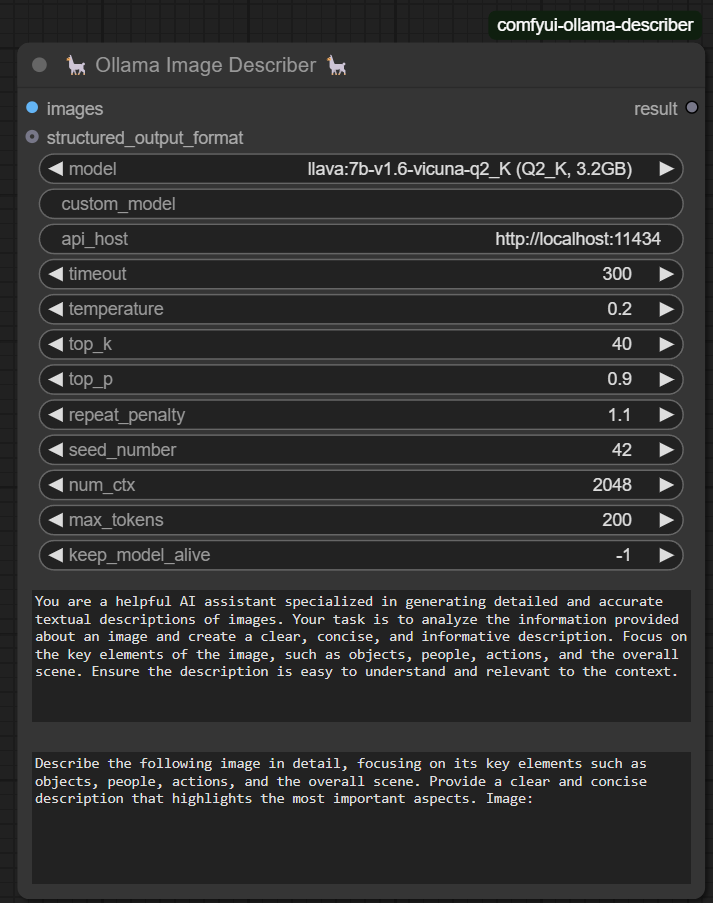
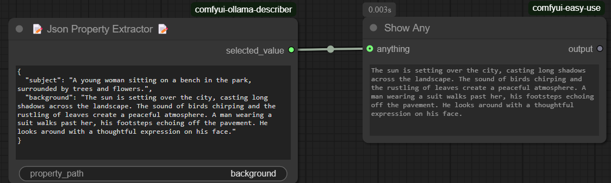
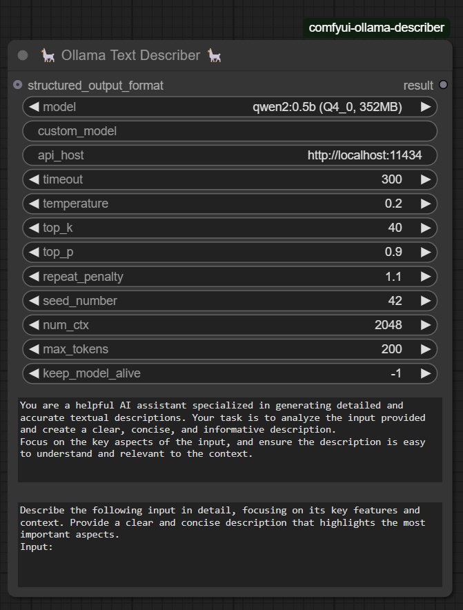
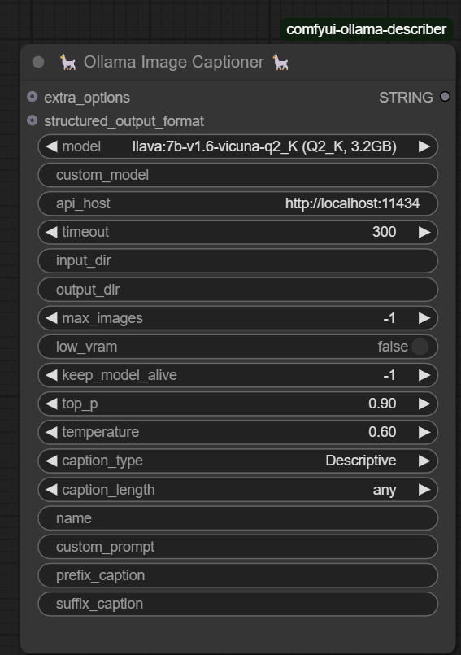
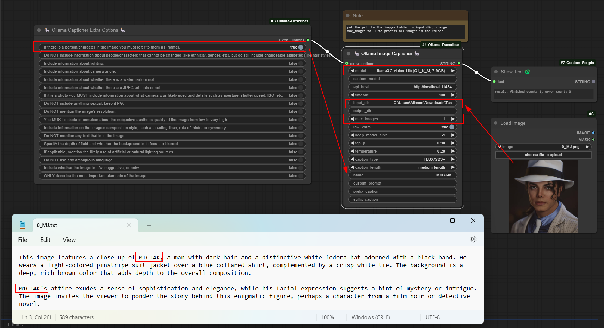
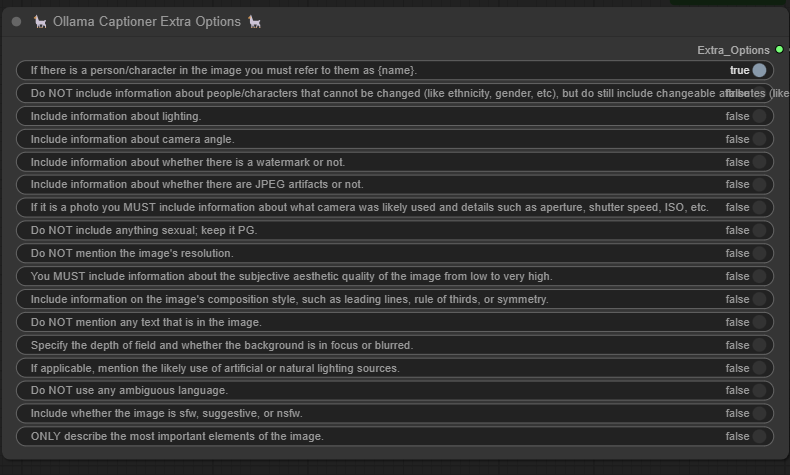
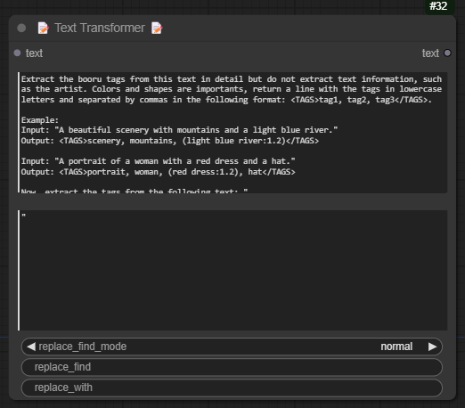

# ComfyUI-Ollama-Describer

## 🚀 News

### [22-02-2025] Added Support for Pydantic Schema Input

- Now, nodes can accept **Pydantic Schemas** as input, making it easier to define structured outputs.

- Example use case:

- To generate Pydantic schemas, you can use the **Python Interpreter Node** by [Christian Byrne](https://github.com/christian-byrne/python-interpreter-node).

---

## Introduction

This extension for [ComfyUI](https://github.com/comfyanonymous/ComfyUI) enables the use of **Ollama LLM models**, such as **Gemma, Llava (multimodal), Llama2, Llama3, and Mistral**.

### 📌 Features:

- **Ollama Image Describer** 🖼️: Generate structured descriptions of images.
- **Ollama Text Describer** 📝: Extract meaningful insights from text.
- **Ollama Image Captioner** 📷: Create automatic captions for images.
- **Ollama Captioner Extra Options** ⚙️: Advanced customization for captions.
- **Text Transformer** 🔄: Prepend, append, or modify text dynamically.
- **JSON Property Extractor** 📑: Extract specific values from JSON outputs.

## Installation

### 1️⃣ Install Ollama

[Follow the official Ollama installation guide](https://ollama.com/).

### 2️⃣ Install via ComfyUI Manager (Recommended)

The easiest way to install this extension is through **ComfyUI Manager**:

- Open **ComfyUI Manager**.
- Search for **ComfyUI-Ollama-Describer**.
- Click **Install** and restart ComfyUI.

### 3️⃣ Install Manually

```bash
git clone https://github.com/alisson-anjos/ComfyUI-Ollama-Describer.git
```

Path should be `custom_nodes\ComfyUI-Ollama-Describer`.

### 4️⃣ Install Dependencies

#### Windows:

Run `install.bat`

#### Linux/Mac:

```bash
pip install -r requirements.txt
```

---

## Usage

### **Ollama Image Describer** 📷🔍



- Extracts structured descriptions from images using vision-enabled LLMs.
- Useful for analyzing images and generating detailed captions, including objects, actions, and surroundings.

#### **Key Parameters:**

- **`model`**: Select LLaVa models (7B, 13B, etc.).
- **`custom_model`**: Specify a custom model from [Ollama's library](https://ollama.com/library).
- **`api_host`**: Define the API address (e.g., `http://localhost:11434`).
- **`timeout`**: Max response time before canceling the request.
- **`temperature`**: Controls randomness (0 = factual, 1 = creative).
- **`top_k`**, **`top_p`**, **`repeat_penalty`**: Fine-tune text generation.
- **`max_tokens`**: Maximum response length in tokens.
- **`seed_number`**: Set seed for reproducibility (-1 for random).
- **`keep_model_alive`**: Defines how long the model stays loaded after execution:
  - `0`: Unloads immediately.
  - `-1`: Stays loaded indefinitely.
  - Any other value (e.g., `10`) keeps it in memory for that number of **seconds**.
- **`prompt`**: The main instruction for the model.
- **`system_context`**: Provide additional context for better responses.
- **`structured_output_format`**: Accepts either a **Python dictionary** or a **valid JSON string** to define the expected response structure.

### **JSON Property Extractor** 📑



- Used to extract specific values from structured JSON outputs returned by **Ollama Image Describer** or **Ollama Text Describer**.
- Works by selecting a key (or path) inside a JSON structure and outputting only the requested data.
- Useful for filtering, extracting key insights, or formatting responses for further processing.
- Compatible with `structured_output_format`, which allows defining structured outputs via a **Python dictionary** or a **valid JSON string**.

### **Ollama Text Describer** 📝🔎



- Processes text inputs to generate structured descriptions or summaries.
- Ideal for refining text-based outputs and enhancing context understanding.

### **Ollama Image Captioner** 🖼️📖





- Automatically generates concise and relevant captions for images.
- Processes images from a specified folder, iterates through each file, and generates `.txt` caption files saved in the output directory.
- Useful for bulk image captioning, dataset preparation, and AI-assisted annotation.
- Useful for image-to-text applications, content tagging, and accessibility.

### **Ollama Captioner Extra Options** 🎛️



- Works in conjunction with **Ollama Image Captioner** to provide additional customization for captions.
- Allows fine-tuning of captions by enabling or disabling specific details like lighting, camera angle, composition, and aesthetic quality.
- Useful for controlling caption verbosity, accuracy, and inclusion of metadata like camera settings or image quality.
- Helps tailor the output for different applications such as dataset labeling, content creation, and accessibility enhancements.

- Provides additional customization settings for generated captions.
- Helps refine style, verbosity, and accuracy based on user preferences.

### **Text Transformer** ✏️



- Allows users to modify, append, prepend, or replace text dynamically.
- Useful for formatting, restructuring, and enhancing text-based outputs.

---

## 🛠️ Technical Details

### **Understanding Model Suffixes & Quantization**

| Suffix         | Meaning                                           |
| -------------- | ------------------------------------------------- |
| **Q**          | Quantized model (smaller, faster)                 |
| **4, 8, etc.** | Number of bits used (lower = smaller & faster)    |
| **K**          | K-means quantization (more efficient)             |
| **M**          | Medium-sized model                                |
| **F16 / F32**  | Floating-point precision (higher = more accurate) |

More details on quantization: [Medium Article](https://medium.com/@ingridwickstevens/quantization-of-llms-with-llama-cpp-9bbf59deda35).

### **Perplexity Explained** 🧠

- Measures how well a model predicts text.
- **Lower perplexity = better predictions**.

[More on perplexity](https://github.com/ggerganov/llama.cpp/pull/1684#issuecomment-1579252501).

---

## References

- [Ollama Website](https://ollama.com/)
- [Ollama GitHub Repository](https://github.com/ollama/ollama)
- [Python Interpreter Node (For Pydantic Schema)](https://github.com/christian-byrne/python-interpreter-node)
- [JoyCaption (Reference Project)](https://github.com/EvilBT/ComfyUI_SLK_joy_caption_two)

