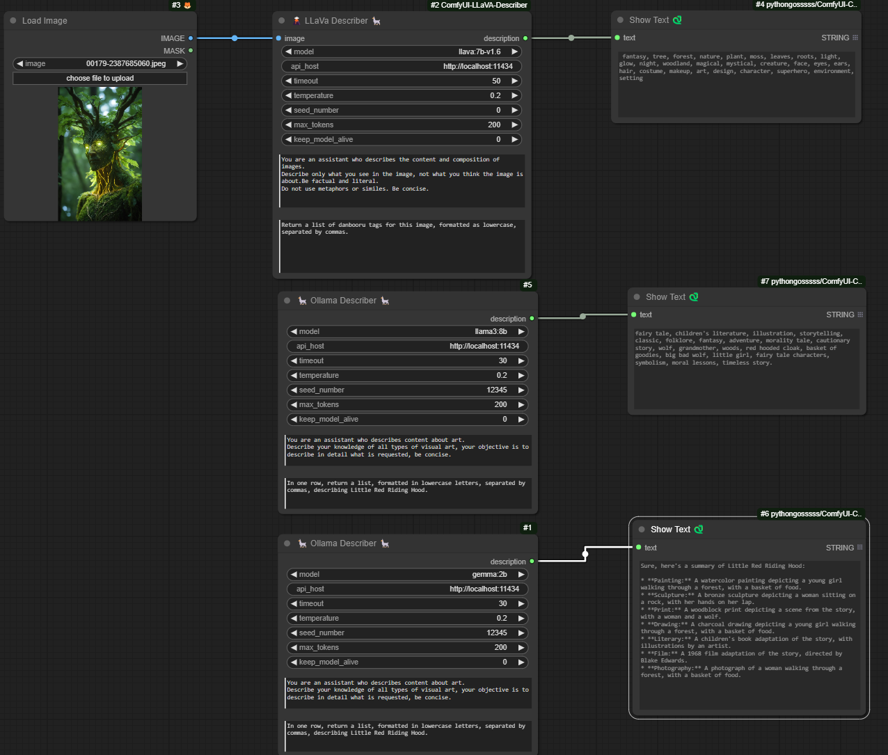
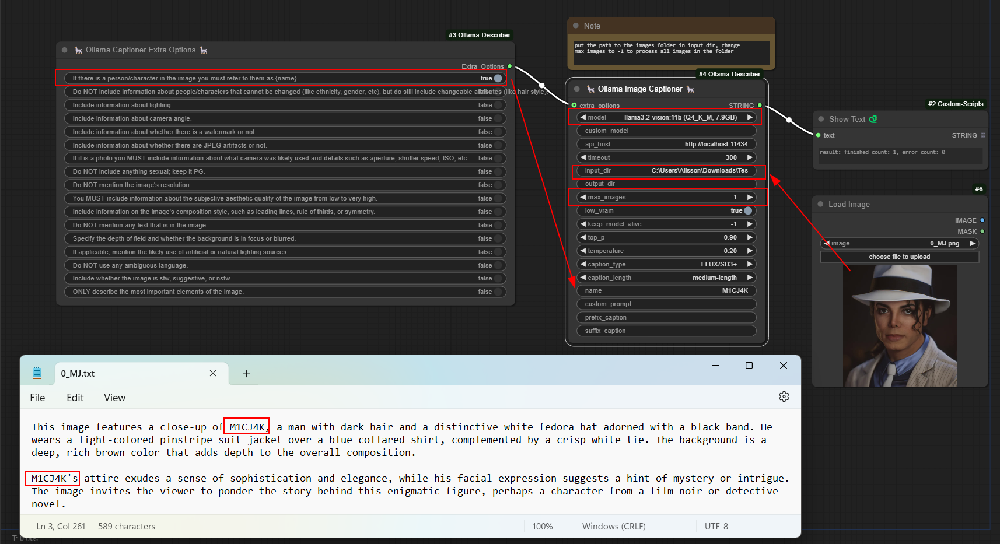
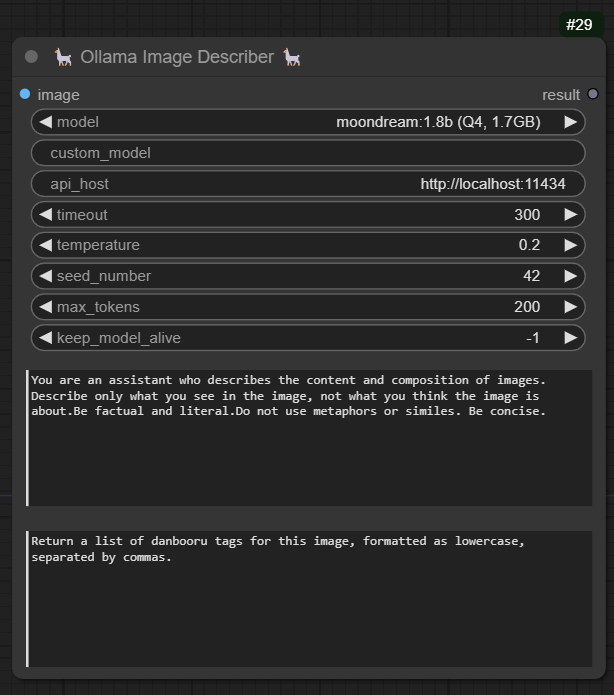
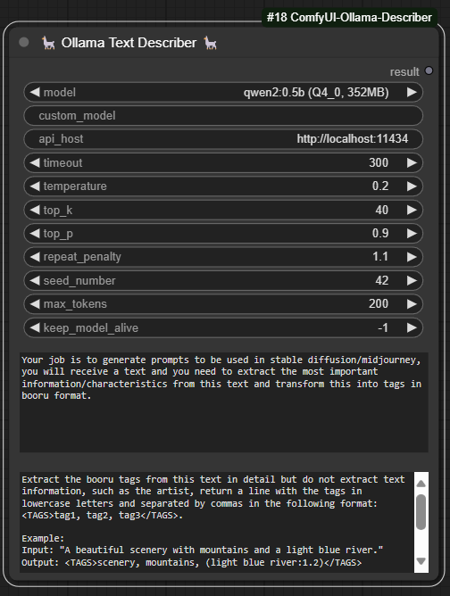
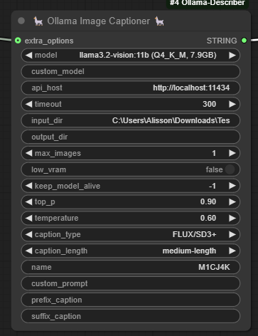
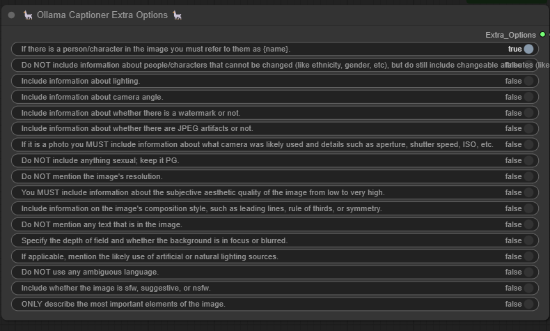
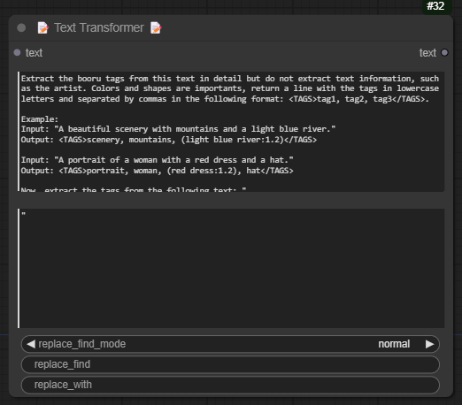

# ComfyUI-Ollama-Describer

This is an extension for [ComfyUI](https://github.com/comfyanonymous/ComfyUI) that makes it possible to use some LLM models provided by Ollama, such as Gemma, Llava (multimodal), Llama2, Llama3 or Mistral. 
### Workflow Examples
#### Ollama Image Describer + Ollama Text Describer



#### Ollama Image Captioner


## Requirements

To use this extension, you will need the Ollama library, which facilitates the use of large-scale language models (LLMs). Ollama provides a simple and efficient interface for interacting with these models, including facilitating the use of GPUs using CUDA (NVIDIA). It also supports AMD GPUs.

Ollama is currently available for installation on Windows, Linux, and Mac. Additionally, you can run Ollama using Docker. In both cases, if you want to use your NVIDIA GPUs to speed up processing, you need to install the NVIDIA CUDA Toolkit.

Follow the guide on the Ollama website and install according to your operating system or opt for usage through a Docker container.

- [Ollama Website](https://ollama.com/)
- [Ollama Docker Hub](https://hub.docker.com/r/ollama/ollama)
- [Ollama GitHub Repository](https://github.com/ollama/ollama)
- [Ollama GPU Installation Guide](https://github.com/ollama/ollama/blob/main/docs/gpu.md)

## Installation

1. Install and Run Ollama
    - [Ollama Website](https://ollama.com/)

2. Clone the repository into your `custom_nodes` folder:
    ```bash
    git clone https://github.com/alisson-anjos/ComfyUI-Ollama-Describer.git
    ```
   The path should be something like `custom_nodes\ComfyUI-Ollama-Describer`.
   
3. Open the folder and execute `install.bat` (Windows) or open a terminal in the folder and run:
    ```bash
    pip install -r requirements.txt
    ```
After installing Ollama and getting it running, you can use the extension in your ComfyUI.

## Usage

You can find an example workflow [OllamaTextAndImage](workflows/OllamaTextAndImage.json) or [OllamaCaptioner](workflows/OllamaCaptioner.json)

### Ollama Image Describer
Add the node via `Ollama` -> `Ollama Image Describer`  



- **images**: Image that will be used to extract/process information, some models accept more than one image, such as llava models, it is up to you to explore which models can use more than one image.
- **model**: Select one of the models, 7b, 13b or 34b, the greater the number of parameters in the selected model the longer it will take to execute the prompt and return the response, use according to the capabilities of your hardware. For most users, I recommend using the 7b/13b model as it offers a good balance between performance and resource requirements.
- **custom_model**: it is possible to use a model that is not in the model list, to do this you need to consult the models available on the [ollama website](https://ollama.com/library) and get the name of the model (Here it is important to use a model that supports vision, because otherwise the image used will not have any impact) and put it in this field for example: moondream:1.8b 
- **api_host**: With this parameter you can specify the address of the API used to communicate with the model, you can use it locally (localhost..) or remotely. Remembering that to run ollama locally, it must be running on your machine.
- **timeout**: With this parameter you can specify the maximum response time, if the time exceeds this value the request will be cancelled.
- **temperature**: The higher this value, or closer to 1, the more creative/random the answer will be. In other words, the model may not follow the instructions added in your prompt or even add false information, the LLaVa model provides good answers with temperatures from 0.2 and below.
- **top_k**: Reduces the probability of generating nonsense. A higher value (e.g. 100) will give more diverse answers, while a lower value (e.g. 10) will be more conservative. (Default: 40)	
- **top_p**: Works together with top-k. A higher value (e.g., 0.95) will lead to more diverse text, while a lower value (e.g., 0.5) will generate more focused and conservative text. (Default: 0.9)
- **repeat_penalty**: Sets how strongly to penalize repetitions. A higher value (e.g., 1.5) will penalize repetitions more strongly, while a lower value (e.g., 0.9) will be more lenient. (Default: 1.1)	
- **seed_number**: Sets the random number seed to use for generation. Setting this to a specific number will cause the template to generate the same text for the same prompt. The default value is 0, to set a random seed set -1.
- **max_tokens**: Maximum length of response, in tokens. A token is approximately half a word.
- **keep_model_alive**: This parameter is used to define how long the model will remain in memory after generation
    - 0 means the model will not remain loaded.
    - -1 means it will stay loaded indefinitely and keep_alive.
    - any other value (e.g. 5, 10, or 20) will keep the model loaded for that amount of time in seconds after generation (always put the value in seconds).
    
    Note: the last node executed is the one that will set the final value for keep_model_alive. Example if you have 3 nodes with different keep_model_alive, the last one executed is the value that will persist.
- **prompt**: Text provided to the model containing a question or instruction.
- **system_context**: This parameter is used to provide a specific context to the model, directly influencing the responses generated by the model. This context is crucial to ensuring that answers are relevant and aligned with the context of the query, even when there is no specific “correct” answer available. (optional)

More information about the parameters can be seen at this [link](https://github.com/ollama/ollama/blob/717f7229eb4f9220d4070aae617923950643d327/docs/modelfile.md#valid-parameters-and-values).

### Ollama Text Describer

Add the node via `Ollama` -> `Ollama Text Describer`  



- **model**: Select one of the available models: Gemma, Llama2, Llama3, or Mistral. Keep in mind that models with a larger number of parameters (e.g., 2b, 7b, 8b, 13b, 70b) are larger in size (gigabytes) and require more powerful hardware to run efficiently. Choose a model that matches the capabilities of your hardware. For most users, I recommend using the 7b/13b model as it offers a good balance between performance and resource requirements.
- **custom_model**: it is possible to use a model that is not in the model list, to do this you need to consult the models available on the [ollama website](https://ollama.com/library) and get the name of the model and put it in this field for example: phi3:3.8b
- **api_host**: With this parameter you can specify the address of the API used to communicate with the model, you can use it locally (localhost..) or remotely. Remembering that to run ollama locally, it must be running on your machine.
- **timeout**: With this parameter you can specify the maximum response time, if the time exceeds this value the request will be cancelled.
- **temperature**: The higher this value, or closer to 1, the more creative/random the answer will be. In other words, the model may not follow the instructions added in your prompt or even add false information, the LLaVa model provides good answers with temperatures from 0.2 and below.
- **top_k**: Reduces the probability of generating nonsense. A higher value (e.g. 100) will give more diverse answers, while a lower value (e.g. 10) will be more conservative. (Default: 40)	
- **top_p**: Works together with top-k. A higher value (e.g., 0.95) will lead to more diverse text, while a lower value (e.g., 0.5) will generate more focused and conservative text. (Default: 0.9)
- **repeat_penalty**: Sets how strongly to penalize repetitions. A higher value (e.g., 1.5) will penalize repetitions more strongly, while a lower value (e.g., 0.9) will be more lenient. (Default: 1.1)	
- **seed_number**: Sets the random number seed to use for generation. Setting this to a specific number will cause the template to generate the same text for the same prompt. The default value is 0, to set a random seed set -1.
- **max_tokens**: Maximum length of response, in tokens. A token is approximately half a word.
- **keep_model_alive**: This parameter is used to define how long the model will remain in memory after generation
    - 0 means the model will not remain loaded.
    - -1 means it will stay loaded indefinitely and keep_alive.
    - any other value (e.g. 5, 10, or 20) will keep the model loaded for that amount of time in seconds after generation (always put the value in seconds).
    
    Note: the last node executed is the one that will set the final value for keep_model_alive. Example if you have 3 nodes with different keep_model_alive, the last one executed is the value that will persist.
- **prompt**: Text provided to the model containing a question or instruction.
- **system_context**: This parameter is used to provide a specific context to the model, directly influencing the responses generated by the model. This context is crucial to ensuring that answers are relevant and aligned with the context of the query, even when there is no specific “correct” answer available. (optional)

More information about the parameters can be seen at this [link](https://github.com/ollama/ollama/blob/717f7229eb4f9220d4070aae61792395064


### Ollama Image Captioner

Add the node via `Ollama` -> `Ollama Image Captioner`  




### Ollama Image Captioner

Add the node via `Ollama` -> `Ollama Captioner Extra Options`  



### Text Transformer

Add the node via `Ollama` -> `Text Transformer`  



- **text**: The main text input where the transformations will be applied. This parameter is mandatory and should contain the content you want to modify. It supports multiline input, allowing for extensive text manipulation.

- **prepend_text**: An optional parameter to add text at the beginning of the main text. This is useful when you need to insert an introduction or header before the main content.

- **append_text**: An optional parameter to add text at the end of the main text. This can be used to insert a footer, signature, or any concluding remarks after the main content.

- **replace_find_mode**: Determines the mode of replacement to use. It has two options:

    - **normal**: In this mode, the replace_find parameter will be treated as a simple string, and all occurrences of this string in the main text will be replaced with the replace_with string.
    - **regular expression (regex)**: In this mode, the replace_find parameter is treated as a regular expression. This allows for more complex text replacements based on patterns. All matches of the regex pattern in the main text will be replaced with the replace_with string.

- **replace_find**: The string or regular expression pattern to be found in the main text. This parameter is used in conjunction with replace_find_mode to determine how the search is conducted. In normal mode, it is a simple string, and in regex mode, it is a regular expression pattern.

- **replace_with**: The replacement string that will be used to replace matches found by replace_find. This parameter works with both normal and regex modes. If replace_find_mode is set to regex, you can use regex replacement syntax (e.g., using capture groups) in this parameter.

## Other information that can help when choosing models.
### Meanings of Suffixes and Prefixes in Model Quantization

- **Q (Quantization)**:
  - **Description**: Indicates that the model has been quantized, meaning the precision of the parameters has been reduced to decrease size and increase efficiency.
  - **Example**: `Q4`, `Q8`
  - **Usage**: Reduces the model size and memory requirements, increasing efficiency on resource-constrained devices.

- **4, 8, etc.**:
  - **Description**: The number of bits used in the quantization process.
  - **Example**: `Q4` (4 bits), `Q8` (8 bits)
  - **Usage**: Indicates the level of quantization and precision reduction. Fewer bits result in smaller and faster models but may sacrifice precision.

- **K (K-means Quantization)**:
  - **Description**: Refers to the use of K-means clustering in the quantization process. K-means quantization creates clusters based on data points, resulting in a more accurate and efficient representation.
  - **Example**: `Q4_K`, `Q8_K`
  - **Usage**: Improves the accuracy of quantized models by grouping similar parameters and retaining the most representative ones.

- **M (Model Size)**:
  - **Description**: Indicates the size of the model after quantization. Can be categorized as Small (S), Medium (M), or Large (L).
  - **Example**: `Q4_K_M` (Medium-sized model quantized with K-means)
  - **Usage**: Provides an indication of the final model size, helping choose the appropriate model for different hardware capabilities.

- **F (Float)**:
  - **Description**: Indicates that the model uses floating-point representation for weights.
  - **Example**: `F16` (16-bit float), `F32` (32-bit float)
  - **Usage**: Maintains high precision with floating-point representation. `F16` halves the memory usage compared to `F32` while maintaining good precision.

- **I (Integer)**:
  - **Description**: Indicates that the model uses integer representation for weights.
  - **Example**: `I8` (8-bit integer), `I32` (32-bit integer)
  - **Usage**: Often used for inference where integer precision is sufficient, allowing for faster and more efficient operations.

### Perplexity ###
- Perplexity is a metric used to evaluate the performance of language models, particularly in the context of natural language processing (NLP). It measures how well a probability model predicts a sample of text. Lower perplexity indicates a better model that can predict the text more accurately.

    - **Example**
    
        Imagine you have a language model and a sentence:

    - **Sentence**: 
    
        "The cat sat on the mat."

    - **Model Prediction**: 
        
        The model assigns probabilities to each possible next word at every step in the sentence.

    If the model predicts the next word in the sentence with high confidence (high probability), the perplexity will be low. Conversely, if the model is uncertain (assigns low probabilities), the perplexity will be high.

[About the difference in perplexity, follow a comment on github.](https://github.com/ggerganov/llama.cpp/pull/1684#issuecomment-1579252501)

### Examples Based on Ollama Models

- **Q4_K**: Quantized 4-bit model using K-means clustering.
  - **Usage**: Smaller models with good memory efficiency, suitable for resource-limited devices.

- **Q8_K_M**: Quantized 8-bit model using K-means clustering, with medium model size.
  - **Usage**: Balances memory efficiency and precision, used in scenarios where precision is critical but size reduction is needed.

- **F16**: Float16, uses 16-bit floating-point precision.
  - **Usage**: Reduces memory usage by half compared to Float32, maintaining good precision for many applications.

- **F32**: Float32, uses 32-bit floating-point precision.
  - **Usage**: High precision, standard for many machine learning model trainings.

### Benefits of Quantization

- **Reduced Memory Footprint**: By reducing parameter precision, quantization significantly decreases the model’s memory requirements, crucial for deployment on memory-limited devices.
- **Increased Speed**: Lower precision computations are carried out faster, leading to quicker model inference, particularly beneficial for real-time applications.
- **Maintained Performance**: Quantization aims to simplify models while preserving their performance, ensuring the countryside still has all the necessary facilities after downsizing.

### Types of Quantization

- **Naive Quantization**: Reduces the precision of all parameters uniformly, without considering the importance of individual parameters.
- **K-means Quantization**: Clusters parameters based on their values and uses representative points for quantization, often followed by pruning parameters with values below a certain threshold.

### Applications of Quantization

- **Inference at the Edge**: Improves efficiency and speed for models running on edge devices like smartphones and IoT devices.
- **Corporate Applications**: Reduces computational and storage requirements in data centers, leading to cost savings in hardware and electricity.

[For more information, see this helpful article](https://medium.com/@ingridwickstevens/quantization-of-llms-with-llama-cpp-9bbf59deda35)


### Projects used as reference:

[JoyCaption](https://github.com/EvilBT/ComfyUI_SLK_joy_caption_two)
