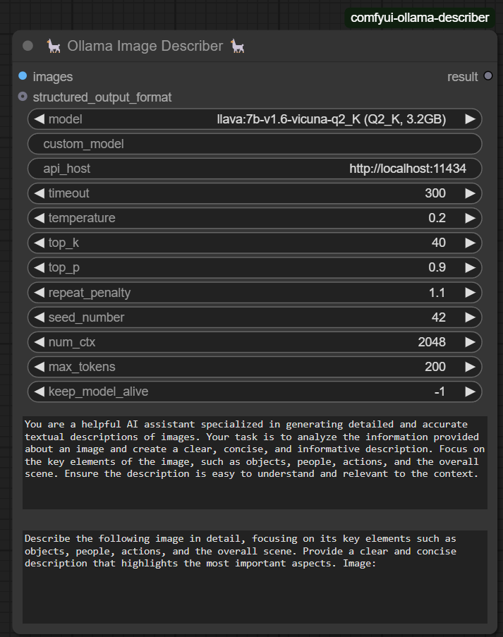
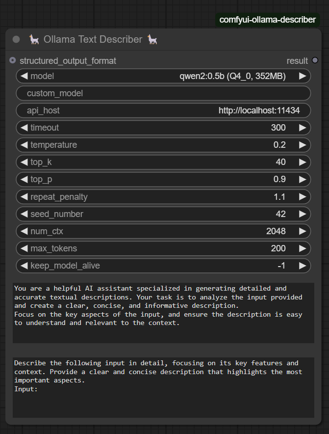
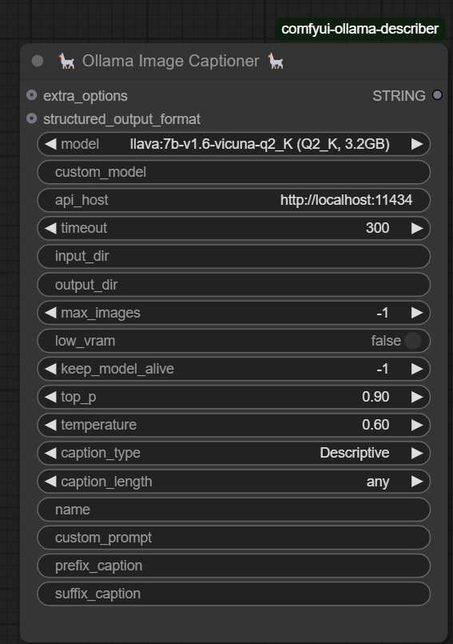
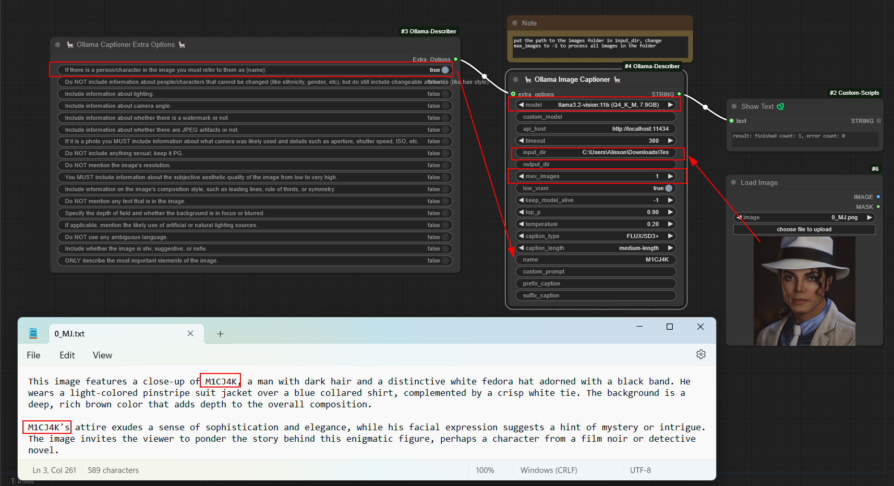
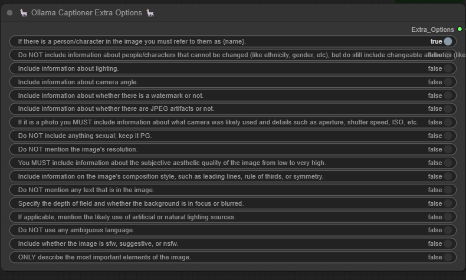
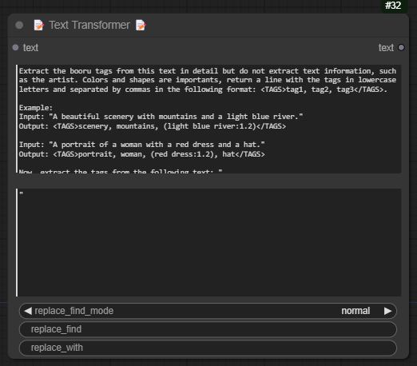

# ComfyUI-Ollama-Describer

## 🚀 News

### [17-03-2025] New Autonomous Agent & Tool Calling 🤖🔍

- **Autonomous Agent Node**: Added the `OllamaAgent` node that can perform iterative reasoning (ReAct) and call tools until it finds the answer.
- **Web Search Tool**: New node to allow models to search the internet (DuckDuckGo or Ollama API).
- **Thinking Support**: Added a 'Think' toggle for models like **Qwen 3.5**, **DeepSeek-R1**, and **GPT-OSS**.
- **UI Enhancements**: Added password-style masking for API keys and improved model selection lists.

---

## Introduction

This extension for [ComfyUI](https://github.com/comfyanonymous/ComfyUI) enables the use of **Ollama LLM models**, such as **Qwen 3.5, DeepSeek-R1, Llama 3.1/3.2, and Mistral**.

### 📌 Features:

- **Autonomous Agent** 🤖: An intelligent agent that can use tools, think, and search the web to answer complex queries.
- **Web Search Tool** 🔍: Connect your Agent to the internet via DuckDuckGo (free) or the Ollama Search API.
- **Support for 'Thinking' Models** 🧠: Full support for reasoning chains in models like Qwen 3.5 and DeepSeek.
- **Ollama Image Describer** 🖼️: Generate structured descriptions of images.
- **Ollama Text Describer** 📝: Extract meaningful insights from text.
- **Ollama Image Captioner** 📷: Create automatic captions for images.
- **Text Transformer** 🔄: Prepend, append, or modify text dynamically.
- **JSON Property Extractor** 📑: Extract specific values from structured outputs.

## Installation

### 1️⃣ Install Ollama

[Follow the official Ollama installation guide](https://ollama.com/).

### 2️⃣ Install via ComfyUI Manager (Recommended)

The easiest way to install this extension is through **ComfyUI Manager**:

- Open **ComfyUI Manager**.
- Search for **ComfyUI-Ollama-Describer**.
- Click **Install** and restart ComfyUI.

### 3️⃣ Install Manually

```bash
git clone https://github.com/alisson-anjos/ComfyUI-Ollama-Describer.git
```

Path should be `custom_nodes\ComfyUI-Ollama-Describer`.

### 4️⃣ Install Dependencies

#### Windows:

Run `install.bat`

#### Linux/Mac/Windows:

```bash
pip install -r requirements.txt
```

---

## Usage

### **Ollama Agent & Tools** 🤖🛠️


The **Ollama Agent** is an autonomous node that can use connected tools to answer questions. It doesn't just generate text; it enters a reasoning loop (**ReAct**) where it can call tools, analyze results, and "think" before giving a final answer.

#### **Key Parameters:**
- **`model`**: Select models optimized for tool calling (e.g., Llama 3.1, Qwen 3.5).
- **`tools`**: Connect `OLLAMA_TOOL` nodes (like Web Search).
- **`think`**: Enable reasoning chains for compatible models (Qwen 3.5, DeepSeek-R1).
- **`system_context`**: Default instructions that force the model to use tools for real-time data.
- **`max_tokens`**: Limit the response length (default 2048).

---

### **Ollama Video Describer** 🎥🔍


Similar to the Image Describer, but optimized for processing video frames or sequences. It allows for detailed temporal analysis using vision-enabled models.

#### **Key Parameters:**
- **`num_ctx`**: Context window size (default 4096, increase for longer descriptions).
- **`max_tokens`**: Maximum length of the video description.
- **`keep_model_alive`**: Manage VRAM by deciding how long to keep the model loaded.

---

### **Web Search Tool** 🌐🔍

- **DuckDuckGo (free)**: No setup needed, search the web for free.
- **Ollama API**: Highly accurate search results, requires a free API key from [ollama.com](https://ollama.com/settings/keys).
- **Max Results**: Control how many snippets are fed back to the Agent.

---

### **Ollama Image Describer** 📷🔍



- Extracts structured descriptions from images using vision-enabled LLMs.
- Useful for analyzing images and generating detailed captions, including objects, actions, and surroundings.

#### **Key Parameters:**

- **`model`**: Select LLaVa models (7B, 13B, etc.).
- **`custom_model`**: Specify a custom model from [Ollama's library](https://ollama.com/library).
- **`api_host`**: Define the API address (e.g., `http://localhost:11434`).
- **`timeout`**: Max response time before canceling the request.
- **`temperature`**: Controls randomness (0 = factual, 1 = creative).
- **`top_k`**, **`top_p`**, **`repeat_penalty`**: Fine-tune text generation.
- **`max_tokens`**: Maximum response length in tokens.
- **`seed_number`**: Set seed for reproducibility (-1 for random).
- **`keep_model_alive`**: Defines how long the model stays loaded after execution.
- **`prompt`**: The main instruction for the model.
- **`system_context`**: Provide additional context for better responses.
- **`structured_output_format`**: Accepts either a **Python dictionary** or a **valid JSON string** to define the expected response structure.

---

### **JSON Property Extractor** 📑

- Used to extract specific values from structured JSON outputs returned by **Ollama Image Describer** or **Ollama Text Describer**.
- Works by selecting a key (or path) inside a JSON structure and outputting only the requested data.
- Useful for filtering, extracting key insights, or formatting responses for further processing.
- Compatible with `structured_output_format`, which allows defining structured outputs via a **Python dictionary** or a **valid JSON string**.

### **Ollama Text Describer** 📝🔎



- Processes text inputs to generate structured descriptions or summaries.
- Ideal for refining text-based outputs and enhancing context understanding.

### **Ollama Image Captioner** 🖼️📖





- Automatically generates concise and relevant captions for images.
- Processes images from a specified folder, iterates through each file, and generates `.txt` caption files saved in the output directory.
- Useful for bulk image captioning, dataset preparation, and AI-assisted annotation.
- Useful for image-to-text applications, content tagging, and accessibility.

### **Ollama Captioner Extra Options** 🎛️



- Works in conjunction with **Ollama Image Captioner** to provide additional customization for captions.
- Allows fine-tuning of captions by enabling or disabling specific details like lighting, camera angle, composition, and aesthetic quality.
- Useful for controlling caption verbosity, accuracy, and inclusion of metadata like camera settings or image quality.
- Helps tailor the output for different applications such as dataset labeling, content creation, and accessibility enhancements.

- Provides additional customization settings for generated captions.
- Helps refine style, verbosity, and accuracy based on user preferences.

### **Text Transformer** ✏️



- Allows users to modify, append, prepend, or replace text dynamically.
- Useful for formatting, restructuring, and enhancing text-based outputs.

---

## 🛠️ Technical Details

### **Understanding Model Suffixes & Quantization**

| Suffix         | Meaning                                           |
| -------------- | ------------------------------------------------- |
| **Q**          | Quantized model (smaller, faster)                 |
| **4, 8, etc.** | Number of bits used (lower = smaller & faster)    |
| **K**          | K-means quantization (more efficient)             |
| **M**          | Medium-sized model                                |
| **F16 / F32**  | Floating-point precision (higher = more accurate) |

More details on quantization: [Medium Article](https://medium.com/@ingridwickstevens/quantization-of-llms-with-llama-cpp-9bbf59deda35).

### **Perplexity Explained** 🧠

- Measures how well a model predicts text.
- **Lower perplexity = better predictions**.

[More on perplexity](https://github.com/ggerganov/llama.cpp/pull/1684#issuecomment-1579252501).

---

## References

- [Ollama Website](https://ollama.com/)
- [Ollama GitHub Repository](https://github.com/ollama/ollama)
- [Python Interpreter Node (For Pydantic Schema)](https://github.com/christian-byrne/python-interpreter-node)
- [JoyCaption (Reference Project)](https://github.com/EvilBT/ComfyUI_SLK_joy_caption_two)

